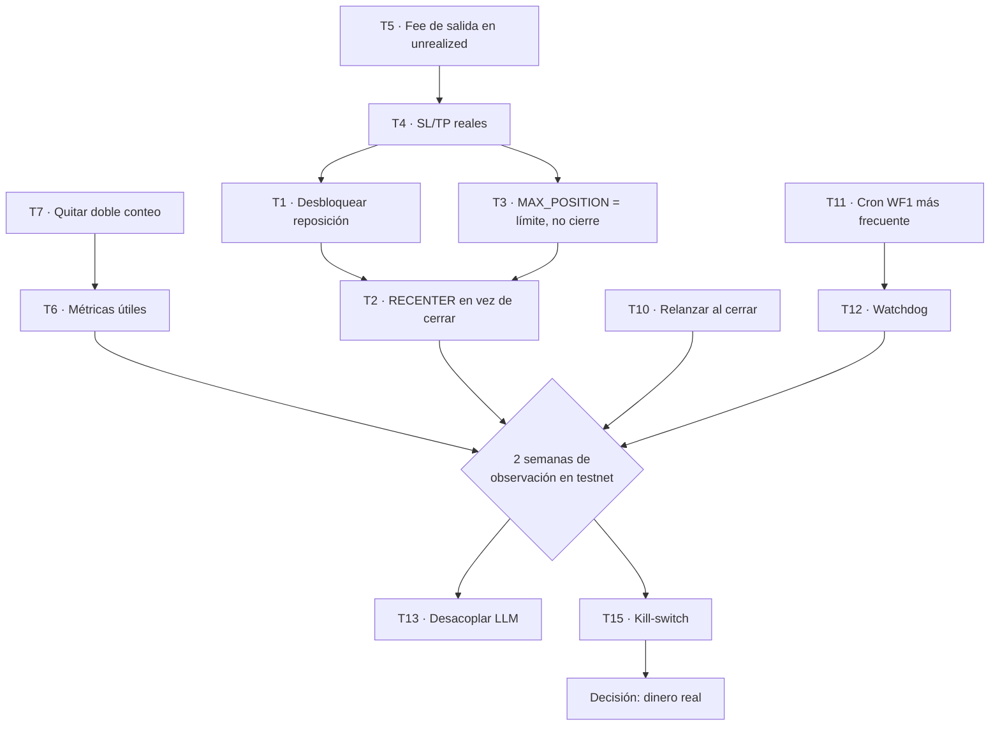

# Plan de mejoras — rentabilidad y operación continua

> **Para el agente que ejecute este plan:** este documento es autosuficiente.
> Antes de tocar código lee igualmente [docs/brain/_index.md](../brain/_index.md)
> y [AGENTS.md](../../AGENTS.md). **Crea una rama de trabajo** (`git checkout -b ...`),
> nunca trabajes sobre `main`: un push a `main` que toque `backend-python/**`
> despliega automáticamente al servidor, y uno que toque `n8n-workflows/*.json`
> reescribe los workflows de producción en vivo.

---

## 0. Objetivo del proyecto (referencia para priorizar)

Declarado por el dueño del repo:

1. Bot operando **7/24**, que **no se quede sin operar**.
2. Que **tome decisiones** por sí mismo.
3. **PRINCIPALMENTE: que sea rentable.**

Todo lo de este documento se prioriza contra esos tres objetivos, en ese orden
inverso (rentabilidad primero).

---

## 1. Diagnóstico: qué dicen los datos reales (2026-08-31)

### 1.1 El número que importa

| Métrica del dashboard | Valor mostrado | Interpretación correcta |
|---|---|---|
| PnL neto (ciclos) | **+12,86 USD** | Ganancia bruta de la mecánica del grid (compra bajo / vende alto). **No es el resultado del bot.** |
| PnL en cierres | **−7,98 USD** (43 grids) | **Este SÍ es el resultado real acumulado** — `total_pnl` de cada grid al cerrarse ya incluye lo realizado por los ciclos. |
| PnL combinado | +4,88 USD | **INCORRECTO — doble conteo.** Ver [T7](#t7). |
| Win rate | 100 % | **Métrica vacía.** Ver [1.4](#14-el-win-rate-de-100--es-un-artefacto). |

**Conclusión: el bot lleva ~2 meses en testnet y su P&L real acumulado es
≈ −8 USD, no +12,86 ni +4,88.** La mecánica del grid gana dinero; la lógica de
**cierre** lo destruye.

### 1.2 Evidencia: el "arrastre de cierre" (closure drag)

`drag = PnL_final_del_grid − PnL_neto_de_sus_ciclos`. Con los datos entregados:

| Grid | Símbolo | Trigger | PnL ciclos | PnL final | **Drag** |
|---|---|---|---|---|---|
| 91b669b0 | BTCUSDT | OUT_OF_RANGE | +5,16 | +0,12 | **−5,04** |
| 9c3f822b | BTCUSDT | MAX_POSITION | +3,64 | +0,18 | **−3,46** |
| 0b8ac23e | BTCUSDT | MAX_POSITION | +1,03 | −1,54 | **−2,57** |
| dc94dd61 | BTCUSDT | MAX_POSITION | +0,41 | −1,85 | **−2,26** |
| 07156261 | ETHUSDT | OUT_OF_RANGE | +0,15 | −0,71 | **−0,86** |
| 4bdbe246 | XRPUSDT | MAX_POSITION | +0,51 | −0,07 | **−0,58** |
| a8884c2d | ETHUSDT | OUT_OF_RANGE | +0,19 | −0,34 | **−0,53** |
| 083eaf7d | ETHUSDT | OUT_OF_RANGE | +0,95 | +0,82 | **−0,13** |
| | | | **+12,04** | **−3,39** | **−15,43** |

Además, **8 de 20 grids cerraron con 0 ciclos** (nunca completaron una vuelta),
y los peores resultados absolutos vienen de ahí: `29b509ab` −2,52,
`b13d5f9a` −2,23, `f7ee588a` −0,96, `a7cb7db6` −0,72.

**Distribución de triggers (20 cierres visibles):** MAX_POSITION 7 ·
OUT_OF_RANGE 7 · RECONCILIATION_FAILED 3 · MANUAL 2 · EXPIRED 1 ·
STOP_LOSS 0 · TAKE_PROFIT 0.

### 1.3 Causa raíz (tres, encadenadas)

**C1 — El grid casi no puede reponer órdenes (bug funcional).**
En [backend-python/app/services/grid_service.py](../../backend-python/app/services/grid_service.py#L682-L692),
`replenish_filled_orders()` bloquea la reposición si el grid es `NEUTRAL` y
`abs(position_amt) > quantity_per_order * 0.05`.

Un grid **funciona precisamente acumulando inventario**: cuando se llena un BUY,
la posición pasa a `1,0 × qty_per_order`, que es **20 veces** la tolerancia de
`0,05 × qty_per_order`. Es decir: **tras el primer fill, la reposición queda
bloqueada de forma prácticamente permanente**. Y como
`_record_completed_cycles()` ([grid_service.py](../../backend-python/app/services/grid_service.py#L499-L525))
solo registra un ciclo cuando una **orden de reposición** se llena, esto explica
a la vez los grids con 0 ciclos y el bajísimo volumen (30 ciclos en ~2 meses con
22 grids). Todos los grids se crean `NEUTRAL` (confirmado en el dashboard).

**C2 — Los cierres cristalizan la pérdida en el peor momento posible.**
`cancel_grid()` ([grid_service.py](../../backend-python/app/services/grid_service.py#L885-L935))
siempre hace `cancel_all_open_orders` + `place_market_close` del inventario neto.
Los dos triggers dominantes disparan **exactamente cuando el inventario está en
su máxima excursión adversa**:

- `MAX_POSITION` ([grid_service.py](../../backend-python/app/services/grid_service.py#L1077-L1085)):
  umbral `MAX_NET_POSITION_LEVELS (3) × qty_per_order × 1,05`. Con grids de 5–13
  niveles, **3 fills del mismo lado matan el grid**. Un grid mata su propia
  operación justo cuando el mercado se movió a favor de acumular (que es cuando
  un grid *debe* acumular).
- `OUT_OF_RANGE` ([grid_service.py](../../backend-python/app/services/grid_service.py#L1057-L1075)):
  si el precio sale del rango, todo el inventario está bajo el agua → market
  close = realizar la pérdida máxima. Es literalmente "vender en el mínimo".

Un grid es una estrategia de **reversión a la media**. Cerrar a mercado en la
excursión adversa convierte un drawdown temporal (recuperable) en una pérdida
permanente. Esto es el 100 % del problema de rentabilidad.

**C3 — No hay control de riesgo real, solo estos dos gatillos.**
`stop_loss` y `take_profit` **nunca se setean**:
[app/auto_params.py](../../backend-python/app/auto_params.py) no los deriva y
WF1 envía `stop_loss: null, take_profit: null` en el `POST /api/v1/grids`.
Por eso hay 0 cierres por STOP_LOSS/TAKE_PROFIT. `MAX_POSITION` está actuando
como stop-loss de facto — un stop-loss pésimo, porque dispara por *cantidad de
inventario*, no por *pérdida en USD*, y sin ninguna relación con el balance.

### 1.4 El "win rate de 100 %" es un artefacto

Un ciclo se registra cuando una orden de reposición se llena. La reposición
siempre se coloca en el nivel adyacente **favorable**
(BUY nivel `i` → SELL nivel `i+1`, más caro; SELL nivel `i` → BUY nivel `i−1`,
más barato), así que `sell_price > buy_price` **por construcción**
([grid_service.py](../../backend-python/app/services/grid_service.py#L545-L560)).
El win rate de ciclos **no puede ser distinto de 100 %**. Las pérdidas viven en
el inventario no emparejado, que nunca se registra como ciclo. **Esta métrica no
debe usarse para decidir el paso a dinero real.**

### 1.5 Inconsistencia adicional a investigar

El dashboard muestra `ROI DEL PERÍODO +0,45 %` (balance del primer snapshot vs.
el último), lo cual contradice los −7,98 USD de cierres. Posibles causas:
recargas del faucet de testnet, funding, o una operación manual. Debe
reconciliarse antes de usar el ROI como criterio ([T9](#t9)).

---

## 2. Puntos fuertes (NO romper al implementar)

Reconocer esto evita que el agente "refactorice" cosas que están bien:

1. **Separación de responsabilidades correcta.** El backend es determinista; n8n
   orquesta; el LLM solo aprueba/rechaza y **nunca** calcula indicadores ni
   coloca órdenes. Es el diseño correcto para no delegar dinero a un LLM.
2. **Idempotencia real en la colocación de órdenes.** Claim atómico en SQLite
   (`UPDATE ... WHERE replenished = 0`) + `clientOrderId` determinístico
   ([grid_service.py](../../backend-python/app/services/grid_service.py#L719-L745)),
   y reintento **por ítem** ante `-1007/-1021` embebidos en un HTTP 200
   (`place_batch_orders` en
   [binance_client.py](../../backend-python/app/services/binance_client.py)).
   Esto es de calidad superior a la media; no tocarlo.
3. **Red de seguridad de reconciliación**: auto-cancel tras 3 refresh fallidos,
   detección de cancelaciones externas, tabla `grid_closures` de auditoría.
4. **Derivación automática de parámetros con puerta de viabilidad**
   ([auto_params.py](../../backend-python/app/auto_params.py)): ER, ATR, volumen,
   funding, `validate_grid_step` que exige step ≥ 5× fees round-trip. Esto evita
   grids estructuralmente imposibles de ganar — y de hecho **se nota**: el
   `PnL de ciclos` es positivo con fees del 4,4 % del bruto.
5. **Guardas de negocio** (1 grid RUNNING por símbolo con índice UNIQUE parcial,
   `MAX_CONCURRENT_GRIDS`, modo one-way obligatorio, margen ISOLATED).
6. **Instrumentación ya construida**: `grid_cycles`, `pnl_snapshots`,
   `grid_closures`, `historical_grid_logs`, dashboard en vivo y `/estado` por
   Telegram. La base para medir existe; hay que corregir *cómo agrega*.
7. **Disciplina de testnet + docs**: cerebro digital, docs numeradas, CI/CD de
   backend y de workflows.

---

## 3. Debilidades priorizadas

| # | Debilidad | Impacto en objetivo | Severidad |
|---|---|---|---|
| D1 | Reposición bloqueada en modo NEUTRAL (C1) | Rentabilidad + "no dejar de operar" | 🔴 Crítica |
| D2 | Cierre a mercado en la excursión adversa (C2) | Rentabilidad | 🔴 Crítica |
| D3 | `MAX_POSITION` = 3 niveles → grid muere en 3 fills | Rentabilidad | 🔴 Crítica |
| D4 | Sin SL/TP reales; sin tope de pérdida en USD | Rentabilidad / riesgo | 🟠 Alta |
| D5 | Dashboard con doble conteo y win-rate vacío | Decisiones a ciegas | 🟠 Alta |
| D6 | Sin relanzamiento automático tras cierre; WF1 solo 5×/día | 7/24 | 🟠 Alta |
| D7 | 3/20 cierres por `RECONCILIATION_FAILED` (15 %) | Estabilidad | 🟠 Alta |
| D8 | `unrealized_pnl` no descuenta fee de salida; `fee_rate` hardcodeado 0,0002 en `indicators.py` mientras `grid_service` usa la real | Precisión de SL/TP | 🟡 Media |
| D9 | Sin kill-switch global ni tope de drawdown diario | Riesgo (crítico si pasa a real) | 🟡 Media |
| D10 | El LLM decidió `launch:true` en el 100 % de los casos: costo + latencia + 504s, valor no medido | Decisiones | 🟡 Media |
| D11 | Sin CI que corra `pytest`; venv local vacío | Calidad | 🟡 Media |
| D12 | Posible carrera `refresh`/`replenish` (cron 5 min + `/monitorear` on-demand) | Estabilidad | 🟡 Media |
| D13 | Sin verificación de posición residual tras `place_market_close` | Operación | 🟢 Baja |
| D14 | `MAX_CONCURRENT_GRIDS = 2` limita diversificación y continuidad | 7/24 | 🟢 Baja |

---

## 4. Plan de acción

### Estado de implementación

Tablero de control del plan. **Mantenerlo actualizado es parte de cada PR.**

| # | Tarea | Fase | Estado | Commit / detalle |
|---|---|---|---|---|
| [T1](#t1) | Permitir que el grid acumule inventario | 1 | ✅ 2026-09-02 | `b315faf` + rama `feat/t1-replenish-status-20260902` — `REPLENISH_POSITION_TOLERANCE_RATIO = 0.80` sobre `MAX_NET_POSITION_LEVELS`. Completado: la reposición reporta `replenish_status: paused_position` + posición/tolerancia en `/refresh` (notificación WF2 + rastro en dashboard), con tests. |
| [T2](#t2) | RECENTER en vez de cerrar (OUT_OF_RANGE) | 1 | ❌ pendiente | **Siguiente en impacto.** Requiere T4 (ya hecho) como freno. |
| [T3](#t3) | `MAX_POSITION` = límite, no gatillo de cierre | 1 | ✅ 2026-08-31 | Cap proporcional a `levels` (`MAX_NET_POSITION_RATIO = 0.6`, piso `MAX_NET_POSITION_LEVELS`). Superarlo pausa la reposición **solo del lado que acumula**; solo cierra al pasar `MAX_POSITION_HARD_MULTIPLE = 2.0×`. |
| [T4](#t4) | Stop-loss / take-profit reales | 1 | ✅ 2026-08-31 | `b315faf` — SL 1 % / TP 3 % del balance, expuestos en `/auto-params` y propagados en WF1. |
| [T5](#t5) | Restar fee de salida al PnL no realizado | 1 | ❌ pendiente | Hace que el SL de T4 dispare con el número correcto. |
| [T6](#t6) | Métricas útiles (closure drag, PnL por trigger…) | 2 | ❌ pendiente | Necesario para validar T2/T3. |
| [T7](#t7) | Eliminar el doble conteo de `combined_pnl` | 2 | ✅ 2026-08-31 | `b315faf` — nuevo `strategy_pnl = cierres + grids vivos`; `combined_pnl` queda como alias. |
| [T8](#t8) | Tablas `bot_executions` / `bot_health_events` | 2 | ❌ pendiente | Requiere que el dueño del repo corra la migración. |
| [T9](#t9) | Reconciliar ROI del período vs. PnL de cierres | 2 | ❌ pendiente | |
| [T10](#t10) | Relanzar automáticamente al cerrar un grid | 3 | ❌ pendiente | Mayor impacto en el objetivo 7/24. |
| [T11](#t11) | Subir frecuencia del cron de WF1 | 3 | ❌ pendiente | Ver T13 antes, por el costo del LLM. |
| [T12](#t12) | Watchdog de "bot inactivo" | 3 | ❌ pendiente | |
| [T13](#t13) | Reducir dependencia del LLM | 3 | ❌ pendiente | |
| [T14](#t14) | Investigar `RECONCILIATION_FAILED` | 4 | ❌ pendiente | 15 % de los cierres. |
| [T15](#t15) | Kill-switch y tope de drawdown diario | 4 | ❌ pendiente | **Bloqueante para pasar a dinero real.** |
| [T16](#t16) | Serializar `refresh` + `replenish` por grid | 4 | ❌ pendiente | Más relevante ahora que T1 genera más reposiciones. |
| [T17](#t17) | Verificar posición residual tras el cierre | 4 | ❌ pendiente | |
| [T18](#t18) | CI que corra los tests | 4 | ❌ pendiente | **Prioridad subida** — ver aviso abajo. |
| T19 | Escalar grids concurrentes | 3 | ✅ 2026-08-31 | `MAX_CONCURRENT_GRIDS` 2 → 4. Multiplica ciclos/día casi linealmente. Subir más exige un tope de exposición agregada (T15). |
| T20 | Filtro de régimen **continuo** (ER en cada ciclo de WF2) | 3 | ❌ pendiente | Hoy el ER solo se evalúa al lanzar. Ver `04-estrategia-y-portafolio.md` §8. |
| T21 | Flip `OUT_OF_RANGE` → posición de breakout | — | ❌ pendiente | Cobertura negativamente correlacionada con el grid. **Solo tras 4+ semanas de grid positivo y después de T2.** Ver `04-estrategia-y-portafolio.md` §4. |
| T22 | Contabilizar el **funding** en el PnL | 2 | ❌ pendiente | Fuga potencialmente material hoy invisible. Ver `04-estrategia-y-portafolio.md` §6. |

**Hecho: 5/22.** Próximo bloque recomendado: **T2 + T5 + T6**.

> ⚠️ Hallazgo al validar la Fase 1: la suite `pytest` de `backend-python/` ya
> tenía **21 fallos preexistentes** en `main` (verificado con un worktree limpio
> en `5a4209a`). Los cambios de T1/T4/T7 no añaden regresiones (21 fallos antes
> y después, +5 tests nuevos que pasan), pero esto **eleva la prioridad de
> [T18](#t18)**: hoy nadie se entera de que la suite está rota.

Cada tarea tiene: **archivo**, **cambio concreto**, **criterio de aceptación** y
**riesgo**. Ejecutar en el orden de las fases. **No mezclar fases en un solo PR.**

> Regla transversal: cualquier constante nueva va a
> [backend-python/app/config_auto_params.py](../../backend-python/app/config_auto_params.py)
> o [backend-python/app/core/config.py](../../backend-python/app/core/config.py),
> nunca hardcodeada en `grid_service.py`.

---

### FASE 1 — Detener la fuga de dinero (máxima prioridad)

#### T1 — Permitir que el grid acumule inventario (arreglar D1) {#t1}

- **Archivo:** [backend-python/app/services/grid_service.py](../../backend-python/app/services/grid_service.py#L682-L692)
- **Estado actual:** `tolerance = qty_per_order * Decimal("0.05")` → bloquea la
  reposición tras el primer fill.
- **Cambio:** la tolerancia debe ser la **misma banda que permite el guard de
  posición**, no un valor de polvo. Nueva constante en `config_auto_params.py`:

  ```python
  # Fracción de MAX_NET_POSITION_LEVELS hasta la que un grid NEUTRAL puede
  # acumular inventario sin dejar de reponer órdenes. El grid necesita
  # inventario para funcionar; solo se pausa cerca del límite duro.
  REPLENISH_POSITION_TOLERANCE_RATIO = Decimal("0.80")
  ```

  y en el guard:

  ```python
  tolerance = (
      Decimal(settings.MAX_NET_POSITION_LEVELS)
      * qty_per_order
      * REPLENISH_POSITION_TOLERANCE_RATIO
  )
  ```

  Con `MAX_NET_POSITION_LEVELS` ya subido por [T3](#t3), esto permite operar
  normalmente y solo pausa la reposición cuando el grid se acerca al límite.
- **Además:** cuando la reposición se bloquee, **no basta con `logger.warning`**.
  Devolver la razón en el resultado de `/refresh` (campo
  `replenish_status: "paused_position"` + `position_amt`/`tolerance`) para que
  WF2 lo pueda notificar y quede rastro en el dashboard.
- **Criterio de aceptación:** en testnet, un grid con ≥ 2 fills del mismo lado
  sigue colocando órdenes de reposición; `grid_cycles` recibe filas nuevas en
  cuestión de horas, no de días. Test unitario nuevo en
  [backend-python/tests/test_grid_service_logging.py](../../backend-python/tests/test_grid_service_logging.py)
  (o archivo nuevo) que cubra: posición dentro de tolerancia → repone; fuera →
  no repone y reporta el motivo.
- **Riesgo:** medio. Aumenta la exposición direccional máxima de un grid. Está
  acotado por `MAX_NET_POSITION_LEVELS` + [T4](#t4) (stop-loss en USD).

#### T2 — Dejar de cristalizar la pérdida: re-centrado en lugar de cierre (arreglar D2) {#t2}

Es el cambio de mayor impacto en rentabilidad. **Implementar como opción
configurable, con el comportamiento actual como fallback.**

- **Archivos:** `grid_service.py` (`close_grid_if_triggered`, `cancel_grid`),
  `config_auto_params.py`, `app/main.py` (nuevo endpoint), WF2.
- **Constantes nuevas:**

  ```python
  # Política ante OUT_OF_RANGE: "CLOSE" (comportamiento histórico) o
  # "RECENTER" (cancelar órdenes, conservar inventario y reconstruir el grid
  # alrededor del precio actual en modo LONG/SHORT).
  OUT_OF_RANGE_POLICY = "RECENTER"
  # Nº máximo de re-centrados por grid antes de forzar cierre.
  MAX_RECENTERS_PER_GRID = 2
  # Margen (en múltiplos de ATR) que el precio debe superar fuera del rango
  # antes de considerar el grid realmente "fuera", para evitar re-centrar por ruido.
  OUT_OF_RANGE_ATR_BUFFER = Decimal("0.5")
  ```

- **Comportamiento `RECENTER`** (nuevo método `recenter_grid(grid_id)`):
  1. Cancelar todas las órdenes abiertas del símbolo (**sin** `place_market_close`).
  2. Recalcular bounds ATR alrededor del precio actual.
  3. Crear un grid nuevo con `grid_mode = LONG` si el inventario heredado es
     positivo, `SHORT` si es negativo, `NEUTRAL` si es ~0 — de modo que el
     `create_grid` no intente cerrar la posición heredada
     ([grid_service.py](../../backend-python/app/services/grid_service.py#L155-L175)).
  4. Registrar en `grid_closures` con `trigger_condition = "RECENTERED"` y
     enlazar el grid nuevo (`parent_grid_id`) para que el dashboard pueda
     encadenar la vida real de la operación.
  5. Incrementar un contador `recenter_count`; al superar
     `MAX_RECENTERS_PER_GRID`, cerrar de verdad.
- **Añadir buffer al gatillo:** en el chequeo de `OUT_OF_RANGE`, no disparar en
  el primer tick fuera del rango; exigir
  `precio < lower − OUT_OF_RANGE_ATR_BUFFER × ATR` (o el simétrico superior)
  **y** que se mantenga fuera en **2 ciclos consecutivos** de WF2 (10 min).
  Guardar el contador en una columna nueva de `grids` (`out_of_range_strikes`).
- **Criterio de aceptación:** un grid al que el precio se le escapa produce un
  evento `RECENTERED` (no un cierre a mercado) y sigue operando; el
  inventario se conserva y se vende en la subida siguiente en vez de liquidarse
  en el mínimo. En backtest/observación: el `drag` promedio por grid mejora
  frente al baseline de la tabla [1.2](#12-evidencia-el-arrastre-de-cierre-closure-drag).
- **Riesgo:** alto si se implementa mal. **Obligatorio** implementar [T4](#t4)
  (stop-loss en USD) en el mismo PR o antes: sin un tope de pérdida absoluto,
  re-centrar indefinidamente en una tendencia fuerte es la receta de una pérdida
  ilimitada. `MAX_RECENTERS_PER_GRID` + stop-loss son los dos frenos.

#### T3 — Recalibrar `MAX_POSITION` para que sea un límite, no un gatillo suicida (arreglar D3) {#t3}

- **Archivos:** [backend-python/app/core/config.py](../../backend-python/app/core/config.py#L63),
  `grid_service.py` ([L1077-L1085](../../backend-python/app/services/grid_service.py#L1077-L1085)).
- **Cambios:**
  1. El umbral debe ser **proporcional a los niveles del grid**, no un 3 fijo.
     Sustituir por `ceil(levels * MAX_NET_POSITION_RATIO)` con
     `MAX_NET_POSITION_RATIO = 0.6` (un grid de 10 niveles puede acumular 6
     niveles de inventario antes de estar "cargado"). Mantener
     `MAX_NET_POSITION_LEVELS` como piso mínimo absoluto (p. ej. 4).
  2. **Al alcanzar el umbral, NO cerrar.** Pasar a estado `PAUSED_ACCUMULATION`:
     dejar de reponer del lado que acumula, seguir reponiendo del lado contrario
     (el que descarga inventario), y seguir monitoreando. Cerrar solo si además
     se dispara el stop-loss en USD ([T4](#t4)) o `EXPIRED`.
- **Criterio de aceptación:** 0 cierres con `trigger_condition = "MAX_POSITION"`
  en una semana de operación; en su lugar aparecen eventos de pausa que se
  resuelven solos cuando el precio revierte.
- **Riesgo:** medio, acotado por [T4](#t4).

#### T4 — Stop-loss y take-profit reales, derivados del balance (arreglar D4) {#t4}

- **Archivos:** [backend-python/app/auto_params.py](../../backend-python/app/auto_params.py),
  `config_auto_params.py`, `n8n-workflows/workflow1-market-decision.json`.
- **Cambios:**
  1. Constantes nuevas:
     ```python
     # Pérdida máxima tolerada por grid, como fracción del balance de la cuenta.
     GRID_STOP_LOSS_PCT_OF_BALANCE = Decimal("0.010")   # 1,0 %
     # Take-profit por grid (0 = deshabilitado; el grid vive de acumular ciclos).
     GRID_TAKE_PROFIT_PCT_OF_BALANCE = Decimal("0.030") # 3,0 %
     ```
  2. `auto_derive_params()` devuelve en `params`:
     `stop_loss = float(balance * GRID_STOP_LOSS_PCT_OF_BALANCE)` y
     `take_profit` análogo (o `None` si la constante es 0).
  3. WF1, nodo *Create Grid (POST)*: reemplazar `stop_loss: null, take_profit: null`
     por los valores que vienen de `/auto-params`.
- **Criterio de aceptación:** un `GET /auto-params?balance=3000` devuelve
  `stop_loss ≈ 30` y `take_profit ≈ 90`; un grid creado por WF1 los persiste en
  SQLite; `check_close` los evalúa (verificable con un test unitario sobre
  `check_sl_tp`, ya existente en [indicators.py](../../backend-python/app/services/indicators.py#L198-L230)).
- **Riesgo:** bajo. Es puramente aditivo y es el freno que habilita T2 y T3.

#### T5 — Restar el fee de salida al PnL no realizado (arreglar D8) {#t5}

- **Archivo:** [backend-python/app/services/indicators.py](../../backend-python/app/services/indicators.py#L177-L190)
- **Cambio:** al calcular `unrealized_pnl`, descontar el fee que costará cerrar
  ese inventario: `unrealized_pnl -= abs(net_position_qty) * current_price * fee_rate`.
  Además, propagar el `fee_rate` **real** (el que ya obtiene `get_commission_rate`
  en `grid_service`) hasta `calculate_grid_pnl()` en lugar del default
  hardcodeado `0.0002`.
- **Criterio de aceptación:** los tests existentes de
  [tests/test_indicators.py](../../backend-python/tests/test_indicators.py) se
  actualizan y pasan; el `total_pnl` deja de ser optimista y por tanto el
  stop-loss de [T4](#t4) dispara con el número correcto.
- **Riesgo:** bajo.

---

### FASE 2 — Medir bien (sin esto no se puede validar la Fase 1)

#### T6 — Métricas que sí significan algo {#t6}

- **Archivos:** [backend-python/app/services/dashboard_data.py](../../backend-python/app/services/dashboard_data.py),
  [backend-python/app/templates/dashboard.html](../../backend-python/app/templates/dashboard.html),
  y en espejo [scripts/dashboard/export_data.py](../../scripts/dashboard/export_data.py).
- **Métricas a añadir:**
  - **Closure drag** por grid y agregado: `closed_pnl − net_cycles_pnl`.
  - **PnL por `trigger_condition`**: total, media y conteo. Es el panel que
    permite verificar si T2/T3 funcionaron.
  - **Tasa de grids rentables** (`closed_pnl > 0` / total cerrados) — la métrica
    que reemplaza al win-rate de ciclos.
  - **Grids con 0 ciclos** (% del total) — mide directamente el efecto de [T1](#t1).
  - **Drawdown máximo** sobre la curva de `pnl_snapshots`.
  - **Tiempo con 0 grids RUNNING** (uptime operativo) — mide el objetivo 7/24.
- **En el HTML:** renombrar la tarjeta "Win rate" a **"Win rate de ciclos
  (estructural, siempre 100 %)"** o directamente eliminarla, y poner
  "Tasa de grids rentables" en su lugar.

#### T7 — Eliminar el doble conteo de `combined_pnl` {#t7}

- **Archivo:** [backend-python/app/services/dashboard_data.py](../../backend-python/app/services/dashboard_data.py#L353-L354)
- **Estado actual:** `"combined_pnl": cycles_pnl_f + closed_pnl_f` y
  `strategy_roi_pct` calculado sobre esa suma.
- **Motivo:** `grid_closures.total_pnl` / `historical_grid_logs.total_pnl` se
  calculan con `calculate_grid_pnl()` = `realized + unrealized`, y `realized` es
  exactamente lo que también suman los `grid_cycles`. Sumarlos cuenta dos veces
  la parte realizada. Verificable: `91b669b0` tiene ciclos por +5,16 y
  `closed_pnl` +0,12 — sumarlos daría +5,28 cuando el grid realmente dejó +0,12.
- **Cambio:**
  ```python
  # PnL real de la estrategia = resultado final de los grids cerrados
  # + PnL vivo de los grids abiertos. NO sumar grid_cycles: su parte
  # realizada ya está dentro de closed_pnl.
  open_pnl_f = sum(num(r["total_pnl"]) or 0 for r in latest_snapshot)
  realized_strategy_pnl = closed_pnl_f + open_pnl_f
  ```
  Exponer `cycles_pnl` aparte, etiquetado como *"ganancia bruta de la mecánica
  del grid (no es el P&L del bot)"*.
- **Criterio de aceptación:** con los datos actuales el dashboard debe mostrar
  **≈ −6,4 USD** (−7,98 de cierres + 1,60 de los dos grids vivos), no +4,88.

#### T8 — Registrar eventos de salud del bot (fase 2 del monitoreo, ya planificada) {#t8}

- Implementar las tablas pendientes descritas en
  [docs/analisis-bot/01-estado-actual-vs-futuro.md](01-estado-actual-vs-futuro.md):
  `bot_executions` (uptime/errores de WF1/WF2) y `bot_health_events`
  (reconciliaciones fallidas, auto-cancelaciones, pausas de reposición,
  re-centrados). Script `migration_003_health_tables.sql` con
  `CREATE TABLE IF NOT EXISTS` — **el dueño del repo lo ejecuta**, el agente no
  tiene acceso a Postgres.

#### T9 — Reconciliar el ROI del período contra el P&L de cierres {#t9}

- Investigar por qué `ROI DEL PERÍODO` da +0,45 % mientras los cierres suman
  −7,98 USD. Revisar si `account_balance` en `pnl_snapshots` incluye recargas
  del faucet de testnet o funding. Si es así, el ROI debe calcularse sobre
  `realized_strategy_pnl / balance_inicial`, no sobre la variación del balance.

---

### FASE 3 — Operar 7/24 sin huecos

#### T10 — Relanzar automáticamente al cerrar un grid (arreglar D6) {#t10}

- **Archivo:** [n8n-workflows/workflow2-monitor.json](../../n8n-workflows/workflow2-monitor.json)
- **Cambio:** en la rama `IF: Grid closed? = true`, después de
  `Notify: Grid Closed`, añadir un nodo `Execute Sub-workflow` que invoque
  **WF1** (`workflowId: yggk1wajL1tsmABi`) — el mismo patrón que ya usa WF3.
  WF1 ya es idempotente: si no hay cupo devuelve 400 "already exists" /
  "Max concurrent grids", que se tratan como informativos.
- **Criterio de aceptación:** el hueco entre cierre y nuevo grid pasa de
  "hasta 4 h (o hasta que el usuario mande `/lanzar`)" a **≤ 5 minutos**.

#### T11 — Subir la frecuencia del cron de WF1 {#t11}

- **Archivo:** `n8n-workflows/workflow1-market-decision.json`, nodo
  *Schedule Trigger (every 4h)*.
- **Estado actual:** dispara a las 04, 08, 12, 16 y 20 (5 veces/día).
- **Cambio:** pasar a `minutesInterval: 30` o `hoursInterval: 1`. Es seguro:
  las guardas de BD rechazan duplicados. **Ojo:** cada corrida consume una
  llamada al LLM → ver [T13](#t13) para evitar que el costo se dispare.
- **Criterio de aceptación:** con `MAX_CONCURRENT_GRIDS` libre, nunca pasan
  más de 60 min con 0 grids RUNNING.

#### T12 — Watchdog de "bot inactivo" {#t12}

- **Archivo:** WF2 (rama nueva) o workflow nuevo.
- **Cambio:** si `GET /api/v1/grids?status=RUNNING` devuelve 0 grids en **3
  ciclos consecutivos** (15 min), enviar alerta a Telegram (`⚠️ Bot sin grids
  activos hace 15 min`) e invocar WF1. Hoy WF2 solo emite
  `Notify: No Running Grids` sin actuar.
- **Criterio de aceptación:** el estado "0 grids activos" nunca dura más de
  ~15 min sin alerta ni intento de relanzamiento.

#### T13 — Reducir la dependencia (y el costo) del LLM (arreglar D10) {#t13}

- **Contexto:** el LLM decidió `launch:true` en el **100 %** de las ejecuciones
  históricas; los criterios de su prompt (`ER > 0.35`, `leverage > 5x con
  ATR% > 2%`, `top_3` vacío, `candidatos < 5`) **son todos deterministas y ya
  computables en [auto_params.py](../../backend-python/app/auto_params.py)**.
  Además fue la fuente de los 504 de NVIDIA NIM.
- **Cambio propuesto (en 2 pasos, no de golpe):**
  1. Implementar esos 4 criterios como **puerta determinista** en el backend
     (extender el `grid_viable` de `/auto-params` con un campo
     `veto_reasons: []`). Loguear en Postgres la decisión determinista **y** la
     del LLM para poder compararlas.
  2. Tras 2–4 semanas de datos: si el LLM nunca discrepa (o discrepa peor),
     degradarlo a **solo notificación explicativa** (redacta el mensaje de
     Telegram) y quitarlo del camino crítico. Así WF1 puede correr cada 30 min
     sin costo ni riesgo de timeout.
- **Nota adicional ya documentada como pendiente en
  [docs/brain/decisiones-tecnicas.md](../brain/decisiones-tecnicas.md):** el
  system prompt no sabe del tope `gridCount = min(IA_gridCount, levels)`.
  Corregirlo o eliminar el campo del schema de respuesta.

---

### FASE 4 — Robustez y riesgo

#### T14 — Investigar los `RECONCILIATION_FAILED` (arreglar D7) {#t14}

3 de 20 cierres (15 %) son grids que murieron por no poder sincronizarse. Cada
uno es un grid que deja de generar dinero. Acciones:
- Añadir el motivo concreto del fallo a `grid_closures` (hoy solo se guarda el
  `trigger_condition`) y a los logs de `_handle_refresh_failure`.
- Aplicar **backoff exponencial** en vez de 3 intentos a intervalo fijo
  (`_MAX_REFRESH_FAILURES = 3` en
  [grid_service.py](../../backend-python/app/services/grid_service.py#L27)), y
  subir el umbral a 5–6 ciclos: 15 min es poco margen para una incidencia
  transitoria de red entre dos servidores distintos.
- Antes de auto-cancelar, intentar una reconstrucción del estado desde
  `GET /fapi/v1/allOrders` en vez de asumir el peor caso.

#### T15 — Kill-switch y tope de drawdown diario (arreglar D9) {#t15}

**Obligatorio antes de pasar a dinero real.**
- Nueva constante `MAX_DAILY_DRAWDOWN_PCT = 0.03` y endpoint
  `POST /api/v1/kill-switch` (+ comando `/pausar` y `/reanudar` en WF3).
- Si el PnL agregado del día cae por debajo del umbral: cerrar todos los grids,
  bloquear `create_grid` hasta reactivación manual y alertar por Telegram.

#### T16 — Serializar `refresh` + `replenish` por grid (arreglar D12) {#t16}

WF2 corre por cron cada 5 min **y** puede lanzarse on-demand con `/monitorear`,
así que dos ciclos pueden solaparse. Añadir un `asyncio.Lock` por `grid_id` en
`GridService` que envuelva `refresh_order_status()` + `replenish_filled_orders()`.
Complementariamente, activar en n8n la opción de **una sola instancia
concurrente** para WF2.

#### T17 — Verificar posición residual tras el cierre (arreglar D13) {#t17}

En `cancel_grid()`, tras `place_market_close`, releer la posición y si
`position_amt != 0` loguear a nivel CRITICAL y registrar un evento en
`bot_health_events` ([T8](#t8)). Hoy el residual solo se descubre cuando falla
la creación del **siguiente** grid.

#### T18 — CI que corra los tests (arreglar D11) {#t18}

Añadir `.github/workflows/tests.yml`: en cada push/PR, `pip install -r
backend-python/requirements.txt` + `pytest -v` desde `backend-python/`. La suite
ya está aislada (Binance mockeado, SQLite descartable, Postgres salteado). Hacer
que `deploy.yml` dependa de ese job.

---

## 5. Orden de ejecución recomendado



**PR sugeridos (uno por bloque, no todo junto):**

1. ✅ **PR-1 «urgente»** (`b315faf`, 2026-08-31) — T7 + T4 + T1. Se adelantaron
   juntos porque T7 dejaba de mentir sobre el resultado, T4 era el freno
   obligatorio y T1 era un bug que dejaba el motor inerte.
2. ✅ **PR-2 «motor»** (2026-08-31) — T3 + T19. `MAX_POSITION` deja de cerrar a
   mercado (pasa a pausar la pata que acumula) y se suben los grids concurrentes
   de 2 a 4.
3. ⬅️ **PR-3 «cierres + medición»** — **T2 + T5 + T6**. Elimina el resto del
   closure drag y calibra el termómetro para poder evaluarlo.
4. **PR-4 «continuidad»** — T10 + T11 + T12 + T20.
5. **PR-5 «robustez»** — T14 + T16 + T17 + T18 + T8 + T22.
6. **PR-6 «decisión»** — T13 + T9 + T15, y evaluar T21.

---

## 6. Criterio de éxito (cómo saber si el plan funcionó)

Medir sobre **2–4 semanas continuas en testnet** tras la Fase 3, usando las
métricas de [T6](#t6):

| Métrica | Baseline hoy | Objetivo |
|---|---|---|
| `realized_strategy_pnl` (T7) | ≈ −6,4 USD | **> 0 y creciente** |
| Closure drag medio por grid | ≈ −1,9 USD | **> −0,3 USD** |
| Grids cerrados con 0 ciclos | 40 % (8/20) | **< 10 %** |
| Cierres por `MAX_POSITION` | 35 % (7/20) | **0 %** |
| Cierres por `RECONCILIATION_FAILED` | 15 % (3/20) | **< 5 %** |
| Tasa de grids rentables | 45 % (9/20) | **> 60 %** |
| Tiempo con 0 grids RUNNING | no medido | **< 5 % del período** |
| Drawdown máximo | no medido | **< 3 % del balance** |

**No pasar a dinero real** hasta cumplir todas y tener [T15](#t15) (kill-switch)
implementado y probado.

---

## 7. Qué NO hacer

- ❌ **No implementar las otras 4 estrategias** del documento raíz
  `Estrategias de Trading Automatizado con n8n y Binance.md` (Breakout NY, Rango
  Asiático, HMM, EMA Cross) ni el orquestador multi-estrategia de
  [02-vision-orquestador-multiestrategia.md](02-vision-orquestador-multiestrategia.md).
  Es una decisión de producto abierta del dueño del repo, y arreglar Grid
  Trading tiene mucho más retorno que añadir estrategias sobre una base que
  pierde dinero.
- ❌ **No tocar** `place_batch_orders()` ni el mecanismo de idempotencia de
  reposición (claim atómico + `clientOrderId` determinístico). Funcionan y
  costaron mucho depurar.
- ❌ **No pasar a mainnet** ni cambiar `BINANCE_TESTNET_URL`.
- ❌ **No editar** `docs/n8n-templates/` (legacy) ni renombrar
  `n8n-workflows/workflow{1,2,3}-*.json` (los nombres son parte del CI/CD).
- ❌ **No commitear** `.env` ni `n8n-workflows/backup-*.json`.
- ❌ **No pushear a `main`** sin entender que eso despliega backend y reescribe
  los workflows de n8n en producción.

---

## 8. Al terminar

Convención del repo ([.github/copilot-instructions.md](../../.github/copilot-instructions.md)):
si un cambio invalida algo de `docs/brain/`, actualizarlo **en el mismo PR**,
incluido el campo `updated` del frontmatter. En concreto, tras la Fase 1 habrá
que actualizar:

- [docs/brain/decisiones-tecnicas.md](../brain/decisiones-tecnicas.md) — las
  secciones de `CHECK_CLOSE_GRACE_MINUTES` y guardas de negocio quedan obsoletas.
- [docs/brain/analisis-bot-monitoreo.md](../brain/analisis-bot-monitoreo.md) —
  estado del monitoreo y hallazgos.
- Este mismo documento: marcar cada tarea como ✅ / ⚠️ / ❌ con la fecha y el
  commit.
