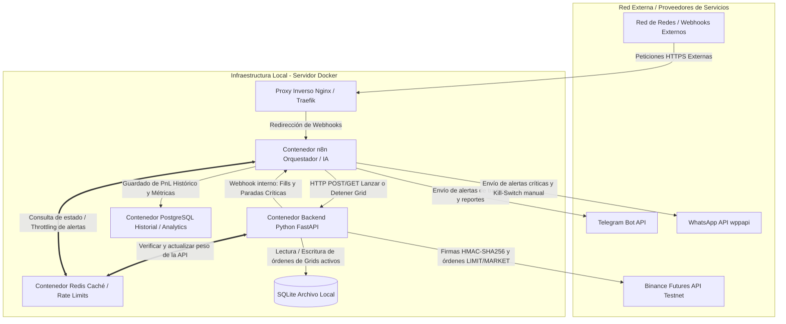

# 🤖 Agente Autónomo de Grid Trading Híbrido

**Plataforma:** Binance Futures Testnet  
**Fase:** 0 - Infraestructura, Consolidación de Datos y Resiliencia  
**Estado:** Backend Python en desarrollo activo (motor de grid funcional) - Orquestador n8n aún no implementado

---

## 📋 Tabla de Contenidos

1. [Resumen Ejecutivo](#resumen-ejecutivo)
2. [Arquitectura del Sistema](#arquitectura-del-sistema)
3. [Componentes y Responsabilidades](#componentes-y-responsabilidades)
4. [Requerimientos Técnicos](#requerimientos-técnicos)
5. [Estructura de Base de Datos](#estructura-de-base-de-datos)
6. [Estructura del Proyecto](#estructura-del-proyecto)

---

## 📌 Resumen Ejecutivo

El **Grid Trading Híbrido** es un sistema autónomo distribuido que ejecuta estrategias de trading en Binance Futures a través de una arquitectura de microservicios en Docker.

> **Nota de estado:** de los componentes descritos en este documento, hoy solo **backend-python** está implementado y operativo. n8n, las notificaciones (Telegram/WhatsApp) y el uso activo de Redis para rate limiting siguen pendientes (ver [Próximos Pasos](#-próximos-pasos)).

**Características clave:**
- ✅ Ejecución de órdenes de Alta Precisión Financiera (`Decimal` + `ROUND_DOWN`, filtros tickSize/stepSize/minNotional)
- ✅ Motor de Grid autónomo (geométrico/aritmético) con cálculo de bounds automático vía ATR
- ✅ Análisis de mercado de solo lectura (`GET /api/v1/market-analysis/{symbol}?risk_pct=0.02&levels=10`) — ATR, bounds sugeridos, quantity sugerida basada en balance, sin crear órdenes (para orquestadores / agentes IA)
- ✅ Sizing dinámico seguro (1-2% riesgo, sin leverage) — `calculate_position_size()` determinística: `quantity = (balance × risk_pct) / (levels × precio_promedio)`; sincroniza con `/fapi/v2/balance` de Binance
- ✅ Stop Loss / Take Profit por grid, evaluados bajo demanda (`/check-close`)
- ✅ Cálculo de PnL realizado/no realizado por grid
- ✅ Colocación de órdenes por lotes (batch orders) con reintentos ante errores de gateway y protección contra duplicados (clientOrderId)
- ✅ Validación — fallar (400) si ninguna orden se coloca (margen insuficiente, filtros de símbolo, etc.)
- ⏳ Orquestación Inteligente con n8n + IA *(planeado, no implementado)*
- ⏳ Gestión de API Rate Limits en Tiempo Real con Redis *(contenedor desplegado, sin uso activo en el código aún)*
- ⏳ Notificaciones en Tiempo Real (Telegram + WhatsApp) *(planeado, no implementado)*


---

## 🏗️ Arquitectura del Sistema

El sistema utiliza una **arquitectura híbrida distribuida** en contenedores independientes sobre Docker, delegando responsabilidades específicas:

- **Backend Python (FastAPI)**: Ejecución financiera, cálculo exacto de niveles y firmas criptográficas
- **Orquestador n8n**: Automatizaciones lógicas, análisis estratégicos y notificaciones
- **Redis**: Caché distribuida y control de rate limits
- **PostgreSQL**: Data warehouse para analítica histórica
- **SQLite**: Base de datos local del motor de grid

### Diagrama de Flujos



---

## 🔧 Componentes y Responsabilidades

| Componente | Rol Principal | Base de Datos | Justificación Técnica | Estado |
|---|---|---|---|---|
| **Backend Python (FastAPI)** | Ejecución financiera, cálculo exacto de niveles, firmas criptográficas | SQLite Local | Baja latencia + Aislamiento total de API Keys | ✅ Implementado |
| **n8n** | Orquestador de flujos lógicos, ingestión de datos externos | PostgreSQL | Interfaz rápida para integraciones sin sobrecargar el backend financiero | ⏳ Planeado |
| **Redis** | Centralizar concurrencia, caché de estados, control de ráfagas | En Memoria | Lectura en tiempo real del peso de API de Binance | ⏳ Contenedor desplegado, sin uso en código |
| **Proxy Inverso** | Terminación SSL y enrutamiento seguro de tráfico | N/A | Protege el backend Python del acceso público directo | ⏳ Planeado |

---

## 📋 Requerimientos Técnicos

### R-01: Autenticación y Criptografía
- ✓ Centralización absoluta de firmas HMAC-SHA256 en backend seguro
- ⚠️ `recvWindow` configurado actualmente en 10000ms (`BINANCE_RECV_WINDOW`, `config.py`) — el requerimiento original pedía ≤ 5000ms; se subió para tolerar latencia, revisar si se quiere volver al límite estricto
- ✓ Exclusión total de API Keys en n8n y Redis

### R-02: Truncado Matemático Estricto
- ✓ Librería nativa Python `Decimal` con `ROUND_DOWN`
- ✓ Adherencia a filtros `/fapi/v1/exchangeInfo` (tickSize, stepSize)
- ✓ **Prohibido**: función `round()` flotante nativa

### R-03: Motor de Grid Autónomo
- ✓ Cálculo local de grilla (geométrica o aritmética) — `grid_engine.py`
- ✓ Bounds (lower/upper price) calculables automáticamente a partir de ATR si no se especifican manualmente — `indicators.py::calculate_atr` / `calculate_grid_bounds`, alimentado por velas (`GET /fapi/v1/klines`)
- ✓ Envío de órdenes LIMIT a Binance, individuales y por lotes (batch, hasta 5 por request) con reintentos ante 502/408 y resolución de duplicados vía `clientOrderId`
- ✓ Stop Loss / Take Profit configurables por grid (umbral de PnL en moneda de cotización), evaluados bajo demanda vía `POST /api/v1/grids/{id}/check-close`
- ✓ Sincronización de estado de órdenes bajo demanda vía `POST /api/v1/grids/{id}/refresh` (no hay scheduler interno; debe ser invocado por un orquestador externo)
- ⏳ Gestión automática de fills parciales en tiempo real (websockets) — pendiente; hoy es polling REST

---

## 💾 Estructura de Base de Datos

### SQLite (Backend Python)
Diseñada para control financiero en caliente con latencia mínima.

**Tabla: `grids`**
```
id (TEXT, PK)           → UUID único
symbol (TEXT)           → Par de trading (ej. BTCUSDT)
lower_price (DECIMAL)   → Límite inferior
upper_price (DECIMAL)   → Límite superior
levels (INTEGER)        → Cantidad de niveles
status (TEXT)           → RUNNING | COMPLETED | STOPPED_BY_SL | PAUSED
stop_loss (DECIMAL)     → Umbral de PnL para auto-cierre (nullable)
take_profit (DECIMAL)   → Umbral de PnL para auto-cierre (nullable)
created_at (TIMESTAMP)  → Fecha de creación
```

**Tabla: `grid_orders`**
```
id (TEXT, PK)           → ID de orden Binance
grid_id (TEXT, FK)      → Referencia a grids
price (DECIMAL)         → Precio del nivel
quantity (DECIMAL)      → Tamaño de la orden
side (TEXT)             → BUY | SELL
type (TEXT)             → LIMIT | MARKET
status (TEXT)           → NEW | FILLED | CANCELED
```

### PostgreSQL (Analytics)
Estructura histórica para análisis de rendimiento a largo plazo.

**Tabla: `historical_grid_logs`**
```
log_id (SERIAL, PK)             → ID autoincremental
grid_id (TEXT)                  → Identificador heredado
symbol (VARCHAR)                → Par operado
total_pnl (NUMERIC)             → Ganancia/Pérdida total
trigger_condition (VARCHAR)     → Razón de cierre
opened_at (TIMESTAMP)           → Fecha apertura
closed_at (TIMESTAMP)           → Fecha cierre
```

---

## 🔌 Endpoints de API (implementados)

Todos los endpoints viven directamente en `app/main.py` (sin `routers/` separados aún). Docs interactivas en `/api/docs`.

| Método | Ruta | Descripción |
|---|---|---|
| GET | `/health` | Health check para Docker |
| GET | `/` | Información del servicio |
| POST | `/api/v1/grids` | Calcula niveles, coloca órdenes en Binance y persiste el grid. `lower_price`/`upper_price` opcionales (se calculan vía ATR si se omiten ambos) |
| GET | `/api/v1/grids` | Lista todos los grids |
| GET | `/api/v1/grids/{grid_id}` | Detalle de un grid, incluyendo sus órdenes |
| DELETE | `/api/v1/grids/{grid_id}` | Cancela todas las órdenes abiertas del grid y lo detiene |
| POST | `/api/v1/grids/{grid_id}/refresh` | Sincroniza el estado de las órdenes con Binance (debe invocarse periódicamente desde un orquestador externo; sin scheduler interno) |
| GET | `/api/v1/grids/{grid_id}/pnl` | Calcula PnL realizado/no realizado a partir del estado local |
| POST | `/api/v1/grids/{grid_id}/check-close` | Compara el PnL actual contra stop_loss/take_profit y cierra el grid si corresponde |

---

## 📁 Estructura del Proyecto

```
TRADING/
│
├── readme.md                      # Este archivo
├── .gitignore                     # Exclusión de .env y archivos sensibles
├── docker-compose.yml             # Orquestación de servicios (backend-python, redis-trading, postgres-trading)
├── docker-compose-actual.yml      # Compose ampliado, compartido con otros servicios de infra personal
├── .env.example                   # Plantilla de variables de entorno
│
├── assets/                        # Recursos visuales
│   └── images/
│       └── Trading Automatizado Híbrido.png
│
├── backend-python/                # Microservicio de Ejecución Financiera (único componente implementado)
│   ├── Dockerfile
│   ├── requirements.txt
│   ├── .gitignore
│   │
│   └── app/
│       ├── __init__.py
│       ├── main.py                # Punto de entrada FastAPI + todos los endpoints
│       │
│       ├── core/                  # Configuración y utilidades
│       │   ├── config.py          # Validación de variables de entorno (pydantic-settings)
│       │   ├── security.py        # Firmas HMAC-SHA256
│       │   └── binance_time.py    # Sincronización horaria con Binance
│       │
│       ├── database/              # Persistencia
│       │   ├── connection.py      # SQLite (grids/órdenes) + engine SQLAlchemy para Postgres
│       │   └── models.py          # Modelo `HistoricalGridLog` (Postgres)
│       │
│       ├── services/              # Lógica de negocio
│       │   ├── binance_client.py  # Wrapper async (aiohttp) sobre Binance Futures Testnet REST
│       │   ├── grid_engine.py     # Cálculo puro de niveles de grid (geométrico/aritmético)
│       │   ├── indicators.py      # ATR, bounds del grid por ATR, cálculo de PnL, chequeo SL/TP
│       │   └── grid_service.py    # Orquesta engine + binance_client + persistencia
│       │
│       └── schemas/               # Validación de payloads (Pydantic)
│           └── grid_schema.py
│
├── .github/workflows/
│   └── deploy.yml                 # CI/CD de despliegue
│
├── tests/                         # Suite de pruebas automatizada
│   ├── conftest.py                # Fixtures: DB aislada por test, Binance mockeado, env vars stub
│   ├── test_api_grids.py          # Pruebas de endpoints (equivalente automatizado del plan Swagger)
│   ├── test_indicators.py         # Pruebas unitarias de ATR, PnL, SL/TP
│   ├── test_grid_engine.py        # Pruebas unitarias del motor de grid
│   ├── test_binance_client.py     # Pruebas unitarias de parseo de klines y firma HMAC
│   └── test_grid_service_logging.py  # Pruebas del registro en historical_grid_logs (Postgres mockeado)
│
├── pytest.ini                     # Configuración de pytest (pythonpath = ., testpaths = tests)
│
└── docs/                          # Documentación técnica
    ├── arquitectura.md
    ├── api-endpoints.md           # Referencia actualizada de endpoints implementados
    ├── manual-test-plan-swagger.md  # Plan de pruebas manuales via Swagger UI (revisado y corregido)
    ├── n8n-integration-strategy.md      # Estrategia de reintentos/idempotencia para n8n
    ├── workflow1-market-decision.md     # Workflow 1: decisión automática de lanzar grid (AI-driven, con sizing dinámico)
    ├── workflow2-monitor.md             # Workflow 2: monitoreo cada 15 min, refresh de órdenes, evalúa SL/TP, notificaciones
    ├── grid-expiration-strategy.md      # Estrategia de expiración de grids (Opción A implementada, Opción B documentada)
    ├── position-sizing-formula.md       # Fórmula de cálculo de quantity per order (risk_pct-based, sin leverage, 1-2% recomendado)
    └── development-guide.md
```

**Pendiente de crear:** `n8n-workflows/` (orquestación, workflows de n8n).

---

## 🚀 Próximos Pasos

- [x] Implementar Backend Python (FastAPI)
- [x] Configurar Docker Compose
- [x] Desarrollar Motor de Grid (cálculo de niveles + bounds automáticos por ATR)
- [x] Stop Loss / Take Profit por grid
- [x] Colocación de órdenes por lotes (batch) y reintentos ante errores de gateway
- [x] Suite de Tests automatizada (54 pruebas, `pytest backend-python/`)
- [ ] Integrar n8n Workflow 1 (consume `GET /api/v1/market-analysis` para decidir si crear grid vía `POST /api/v1/grids`, con manejo de reintentos — ver [workflow1-market-decision.md](docs/workflow1-market-decision.md) y [n8n-integration-strategy.md](docs/n8n-integration-strategy.md))
- [ ] Integrar n8n Workflow 2 (monitorea grids cada 15 min, sincroniza órdenes, evalúa SL/TP — ver [workflow2-monitor.md](docs/workflow2-monitor.md))
- [ ] Establecer Rate Limit Manager (Redis) — contenedor desplegado, sin lógica de rate limiting en el código aún
- [ ] Notificaciones Telegram / WhatsApp
- [ ] Streaming de mercado vía WebSocket (hoy es polling REST)
- [ ] Crear Suite de Tests automatizada
- [ ] Scheduler interno para `/refresh` y `/check-close` (hoy se asume un llamador externo)

---

## 📞 Contacto

Agente desarrollado como parte de la infraestructura automatizada.
