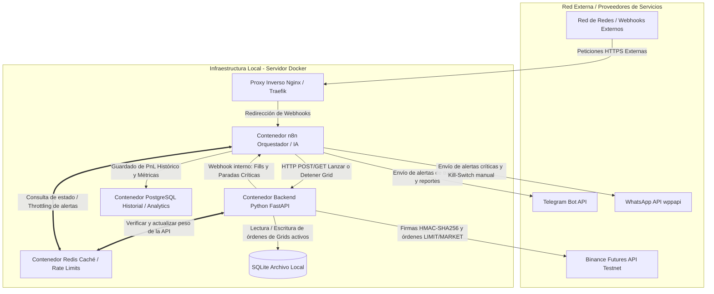

# 🤖 Agente Autónomo de Grid Trading Híbrido

**Plataforma:** Binance Futures Testnet  
**Fase:** 0 - Infraestructura, Consolidación de Datos y Resiliencia  
**Estado:** En Planificación

---

## 📋 Tabla de Contenidos

1. [Resumen Ejecutivo](#resumen-ejecutivo)
2. [Arquitectura del Sistema](#arquitectura-del-sistema)
3. [Componentes y Responsabilidades](#componentes-y-responsabilidades)
4. [Requerimientos Técnicos](#requerimientos-técnicos)
5. [Estructura de Base de Datos](#estructura-de-base-de-datos)
6. [Estructura del Proyecto](#estructura-del-proyecto)

---

## 📌 Resumen Ejecutivo

El **Grid Trading Híbrido** es un sistema autónomo distribuido que ejecuta estrategias de trading en Binance Futures a través de una arquitectura de microservicios en Docker. 

**Características clave:**
- ✅ Ejecución de órdenes de Alta Precisión Financiera
- ✅ Orquestación Inteligente con n8n + IA
- ✅ Gestión de API Rate Limits en Tiempo Real
- ✅ Persistencia Segura de Credenciales y Estados
- ✅ Notificaciones en Tiempo Real (Telegram + WhatsApp)


---

## 🏗️ Arquitectura del Sistema

El sistema utiliza una **arquitectura híbrida distribuida** en contenedores independientes sobre Docker, delegando responsabilidades específicas:

- **Backend Python (FastAPI)**: Ejecución financiera, cálculo exacto de niveles y firmas criptográficas
- **Orquestador n8n**: Automatizaciones lógicas, análisis estratégicos y notificaciones
- **Redis**: Caché distribuida y control de rate limits
- **PostgreSQL**: Data warehouse para analítica histórica
- **SQLite**: Base de datos local del motor de grid

### Diagrama de Flujos



---

## 🔧 Componentes y Responsabilidades

| Componente | Rol Principal | Base de Datos | Justificación Técnica |
|---|---|---|---|
| **Backend Python (FastAPI)** | Ejecución financiera, cálculo exacto de niveles, firmas criptográficas | SQLite Local | Baja latencia + Aislamiento total de API Keys |
| **n8n** | Orquestador de flujos lógicos, ingestión de datos externos | PostgreSQL | Interfaz rápida para integraciones sin sobrecargar el backend financiero |
| **Redis** | Centralizar concurrencia, caché de estados, control de ráfagas | En Memoria | Lectura en tiempo real del peso de API de Binance |
| **Proxy Inverso** | Terminación SSL y enrutamiento seguro de tráfico | N/A | Protege el backend Python del acceso público directo |

---

## 📋 Requerimientos Técnicos

### R-01: Autenticación y Criptografía
- ✓ Centralización absoluta de firmas HMAC-SHA256 en backend seguro
- ✓ Validación obligatoria de `recvWindow ≤ 5000ms` (Binance)
- ✓ Exclusión total de API Keys en n8n y Redis

### R-02: Truncado Matemático Estricto
- ✓ Librería nativa Python `Decimal` con `ROUND_DOWN`
- ✓ Adherencia a filtros `/fapi/v1/exchangeInfo` (tickSize, stepSize)
- ✓ **Prohibido**: función `round()` flotante nativa

### R-03: Motor Simulado de Grid Autónomo
- ✓ Cálculo local de grilla (geométrica o aritmética)
- ✓ Envío individual de órdenes LIMIT a Binance
- ✓ Gestión automática de fills parciales

---

## 💾 Estructura de Base de Datos

### SQLite (Backend Python)
Diseñada para control financiero en caliente con latencia mínima.

**Tabla: `grids`**
```
id (TEXT, PK)           → UUID único
symbol (TEXT)           → Par de trading (ej. BTCUSDT)
lower_price (DECIMAL)   → Límite inferior
upper_price (DECIMAL)   → Límite superior
levels (INTEGER)        → Cantidad de niveles
status (TEXT)           → RUNNING | COMPLETED | STOPPED_BY_SL | PAUSED
created_at (TIMESTAMP)  → Fecha de creación
```

**Tabla: `grid_orders`**
```
id (TEXT, PK)           → ID de orden Binance
grid_id (TEXT, FK)      → Referencia a grids
price (DECIMAL)         → Precio del nivel
quantity (DECIMAL)      → Tamaño de la orden
side (TEXT)             → BUY | SELL
type (TEXT)             → LIMIT | MARKET
status (TEXT)           → NEW | FILLED | CANCELED
```

### PostgreSQL (Analytics)
Estructura histórica para análisis de rendimiento a largo plazo.

**Tabla: `historical_grid_logs`**
```
log_id (SERIAL, PK)             → ID autoincremental
grid_id (TEXT)                  → Identificador heredado
symbol (VARCHAR)                → Par operado
total_pnl (NUMERIC)             → Ganancia/Pérdida total
trigger_condition (VARCHAR)     → Razón de cierre
opened_at (TIMESTAMP)           → Fecha apertura
closed_at (TIMESTAMP)           → Fecha cierre
```

---

## 📁 Estructura del Proyecto

```
trading-grid-hybrid/
│
├── README.md                      # Este archivo
├── .gitignore                     # Exclusión de .env y archivos sensibles
├── docker-compose.yml             # Orquestación de servicios
├── .env.example                   # Plantilla de variables de entorno
│
├── assets/                        # Recursos visuales
│   └── images/
│       └── Trading Automatizado Híbrido.png
│
├── backend-python/                # Microservicio de Ejecución Financiera
│   ├── Dockerfile
│   ├── requirements.txt
│   ├── .gitignore
│   │
│   └── app/
│       ├── __init__.py
│       ├── main.py                # Punto de entrada FastAPI
│       │
│       ├── core/                  # Configuración y utilidades
│       │   ├── config.py          # Validación de variables de entorno
│       │   ├── security.py        # Lógica HMAC-SHA256
│       │   └── binance_time.py    # Sincronización horaria
│       │
│       ├── database/              # Persistencia local
│       │   ├── connection.py      # Configuración SQLite
│       │   └── models.py          # Definición de tablas
│       │
│       ├── services/              # Lógica de negocio
│       │   ├── binance_client.py  # Wrapper Binance API
│       │   └── grid_engine.py     # Motor de cálculo de grid
│       │
│       └── schemas/               # Validación de payloads
│           └── grid_schema.py     # Modelos Pydantic
│
├── n8n-workflows/                 # Flujos de orquestación
│   ├── grid-launcher.json         # Inicio de estrategias
│   ├── grid-monitor.json          # Monitoreo en tiempo real
│   └── notifications.json         # Alertas a usuarios
│
├── docs/                          # Documentación técnica
│   ├── arquitectura.md
│   ├── api-endpoints.md
│   └── development-guide.md
│
└── tests/                         # Suite de pruebas
    ├── test_grid_engine.py
    └── test_binance_client.py
```

---

## 🚀 Próximos Pasos

- [ ] Implementar Backend Python (FastAPI)
- [ ] Configurar Docker Compose
- [ ] Desarrollar Motor de Grid
- [ ] Integrar n8n Workflows
- [ ] Establecer Rate Limit Manager (Redis)
- [ ] Crear Suite de Tests
- [ ] Documentación de API

---

## 📞 Contacto

Agente desarrollado como parte de la infraestructura automatizada.
